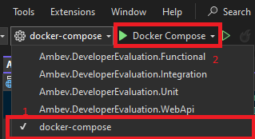

# Ambev Developer Evaluation

Este é um sistema completo de avaliação de desenvolvedores, utilizando a arquitetura CQRS e baseado em **DDD (Domain-Driven Design)**, incluindo funcionalidades de Vendas, Carrinho de Compras, Usuários, Clientes, Produtos, e autenticação segura. A aplicação utiliza **.NET 8**, é containerizada com **Docker** e **docker-compose**, e emprega diversas tecnologias avançadas como mensageria, eventos de domínio, Mediator, FluentValidation, e mais.

## **Sumário**

- [Recursos Principais](#recursos-principais)
- [Tecnologias Utilizadas](#tecnologias-utilizadas)
- [Pré-requisitos](#pré-requisitos)
- [Configuração do Ambiente](#configuração-do-ambiente)
- [Como Executar o Projeto](#como-executar-o-projeto)
- [Como Rodar os Testes](#como-rodar-os-testes)
- [Estrutura do Projeto](#estrutura-do-projeto)
- [API Endpoints](#api-endpoints)

---

## **Recursos Principais**

- **Vendas (Sale):** Gerenciamento completo de vendas, com regras de negócio e eventos.
- **Carrinho de Compras (Cart):** CRUD para adicionar, atualizar e excluir itens no carrinho antes da venda.
- **Filiais (Branch) e Produtos (Product):** Cadastro e gerenciamento para suportar operações de vendas.
- **Usuários (User) e Clientes (Customer):** Registro, autenticação e perfis de usuários.
- **Mensageria:** Uso do RabbitMQ para comunicação assíncrona com sistemas externos.
- **Cache e Banco de Dados:** Integração com Redis e PostgreSQL.
- **Autenticação:** Sistema seguro baseado em JWT.
- **Domain Events e Mediator:** Uso de eventos para comunicação interna desacoplada.

---

## **Tecnologias Utilizadas**

- **.NET 8**
- **Docker & Docker Compose**
- **PostgreSQL** (Banco relacional)
- **MongoDB** (NoSQL)
- **Redis** (Cache)
- **RabbitMQ** (Mensageria)
- **FluentValidation** (Validações)
- **AutoMapper** (Mapeamento de Objetos)
- **MediatR** (Mediador)
- **XUnit e NSubstitute** (Testes unitários e mocks)

---

## **Pré-requisitos**

Certifique-se de que os seguintes softwares estejam instalados no seu computador:

1. [.NET 8 SDK](https://dotnet.microsoft.com/download/dotnet/8.0)
2. [Docker](https://www.docker.com/)
3. [Docker Compose](https://docs.docker.com/compose/install/)
4. Editor de código (ex: [Visual Studio Code](https://code.visualstudio.com/))

---

## **Configuração do Ambiente**

1. Clone o repositório:

   ```bash
   git clone <URL_DO_REPOSITORIO>
   ```

2. Configure variáveis de ambiente no arquivo `.env`:

```json
{
   "ConnectionStrings": {
    "DefaultConnection": "Host=ambev_developer_evaluation_database;Port=5432;Database=developer_evaluation;Username=developer;Password=ev@luAt10n"
  }
}
```

3. (Opcional) Use o arquivo `docker-compose.override.yml` para customizações locais do docker-compose.

---

## **Como Executar o Projeto**

1. Suba os serviços no Docker:

   ```bash
   docker-compose up --build
   ```

    Ou no Visual Studio (_recomendado_):

    

    - Isso iniciará:
        - API: `https://localhost:60981`
        - Banco de dados PostgreSQL: `localhost:5432`
        - MongoDB: `localhost:27017`
        - RabbitMQ: `localhost:15672`
        - Redis: `localhost:6379`

2. Acesse a aplicação:
   - **Swagger UI:** [Swagger UI](https://localhost:60981/swagger/index.html)
   - **RabbitMQ Management:** [RabbitMQ Management:](http://localhost:15672)

3. **Observação:** Não é necessário executar o comando `dotnet ef database update` para criar as tabelas no banco. Há um método responsável por automatizar este processo:

```CSharp
public static class DatabaseConfig
{
    /// <summary>
    ///     Apply Migrations automatically without needing to run update in the CLI
    /// </summary>
    /// <param name="app"></param>
    public static void ApplyMigrations(this WebApplication app)
    {
        var services = app.Services.CreateScope().ServiceProvider;
        var dataContext = services.GetRequiredService<DefaultContext>();
        dataContext.Database.Migrate();
    }
}
```

---

## **Como Rodar os Testes**

### Testes Unitários

1. Execute:

   ```bash
   dotnet test Ambev.DeveloperEvaluation.Unit
   ```

### Testes de Integração

1. Execute:

   ```bash
   dotnet test Ambev.DeveloperEvaluation.Integration
   ```

### Testes Funcionais

1. Execute:

   ```bash
   dotnet test Ambev.DeveloperEvaluation.Functional
   ```

---

## **Estrutura do Projeto**

A aplicação está estruturada seguindo o padrão do **CQRS** e do **Domain-Driven Design (DDD)**.

- **Adapters**: Conexões com recursos externos (ex: ORMs, Mensageria, Api).
  - **Drivers**: Interfaces primárias para interação (ex: APIs).
- **Core**: Contém a lógica central da aplicação.
  - **Application**: Casos de uso, Handlers e Mediator.
  - **Domain**: Entidades, Regras de Negócio e Eventos de Domínio.
- **Crosscutting**: Ferramentas genéricas como IoC e configurações comuns.
- **Tests**: Projetos para Unit, Integration e Functional Tests.

---

## **API Endpoints**

### **Carrinho de Compras**

#### **GET /carts/get-by-userid/{userId}**

- Descrição: Retorna o carrinho e seus produtos
- Response:

  ```json
  {
    "success": true,
    "message": "string",
    "errors": [
        {
        "error": "string",
        "detail": "string"
        }
    ],
    "data": {
        "id": "guid",
        "userId": "guid",
        "date": "datetime",
        "products": [
        {
            "id": "guid",
            "productId": "guid",
            "quantity": "integer"
        }
        ]
    }
  }
  ```

#### **PUT /carts/create-or-update-item/{userId}**

- Descrição: Adiciona ou atualiza um item no carrinho.
- body:

  ```json
  {
    "productId": "guid",
    "quantity": "integer",
  }
  ```

- Response:

  ```json
    {
        "success": true,
        "message": "string",
        "errors": [
            {
            "error": "string",
            "detail": "string"
            }
        ],
        "data": {
            "id": "guid",
            "userId": "guid",
            "date": "datetime",
            "products": [
            {
                "id": "guid",
                "productId": "guid",
                "quantity": "integer"
            }
            ]
        }
    }
    ```

#### **DELETE /carts/remove-item/{userId}/{productId}**

- Descrição: Remove um carrinho específico.

- Response

    ```json
    {
        "success": true,
        "message": "string",
        "errors": [
            {
            "error": "string",
            "detail": "string"
            }
        ]
    }
    ```

Consulte o [Swagger UI](https://localhost:60981/swagger/index.html) para mais detalhes e ver os demais endpoints.

---

## **Contribuições**

Contribuições são bem-vindas! Por favor, crie um pull request com suas mudanças.
